# Summary
This repository is a collection of audio effects plugins implemented from the explanations in the book *"Audio Effects: Theory, Implementation and Application"* by Joshua D. Reiss and Andrew P. McPherson, and takes as example the code provided with the book which has contributions and implementations by Brecht De Man, and others.

The audio effects implemented are:

- [**Template Time Domain**](Template%20Time%20Domain) implements a generic graphic user interface with linear and logarithmic sliders, toggles, and combo-boxes. This project introduces a custom class of audio parameters that encapsulates a lot of the complexity to add, setup, and use automatable plugin parameters in both the audio processor and the generic editor (GUI). This plugin does not apply any particularly interesting processing to the input, it just a template project for time domain audio processing effects.


- [**Template Frequency Domain**](Template%20Frequency%20Domain) implements a short-time Fourier transform class. This plugin does not apply any processing to the input, it just converts the input block to the frequency domain, and back to the time domain using the overlap-add method. This plugin is used as a template project for frequency domain audio processing effects.


- [**Delay**](Delay) implements a basic delay with feedback and mix controls using a circular delay line. It uses simple linear interpolation to achieve fractional delay times.
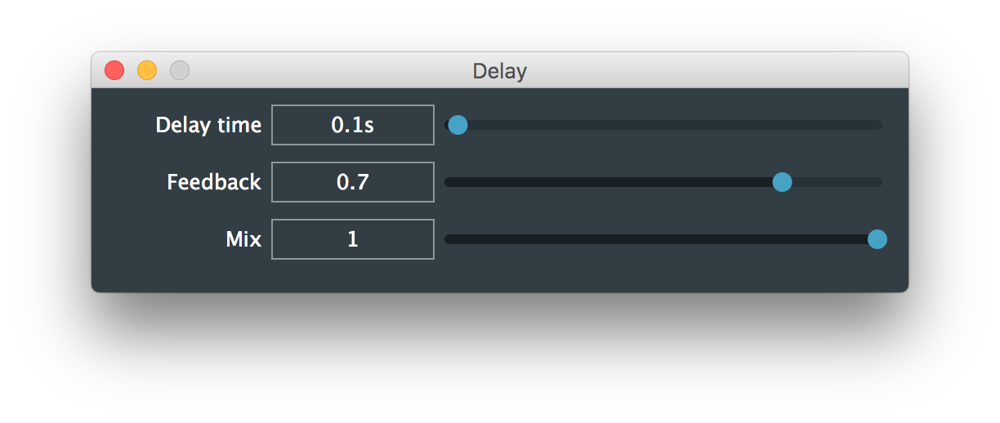

- [**Vibrato**](Vibrato) uses a Low Frequency Oscilator (LFO) to modulate the delay of the input signal and simulate periodic variations of pitch. Various types of sample interpolation are introduced in this plugin.
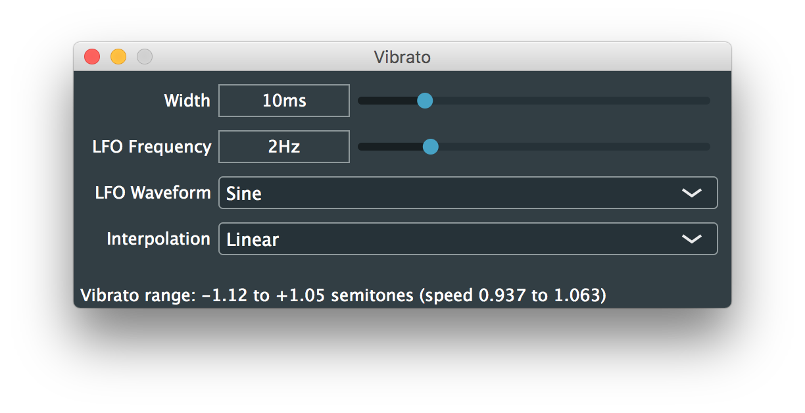

- [**Flanger**](Flanger) simulates a delay-based audio effect where a copy of the input signal is delayed with a variable delay time, and mixed with the original sound, thus producing the characteristic "swooshing" sound of this classic audio effect.
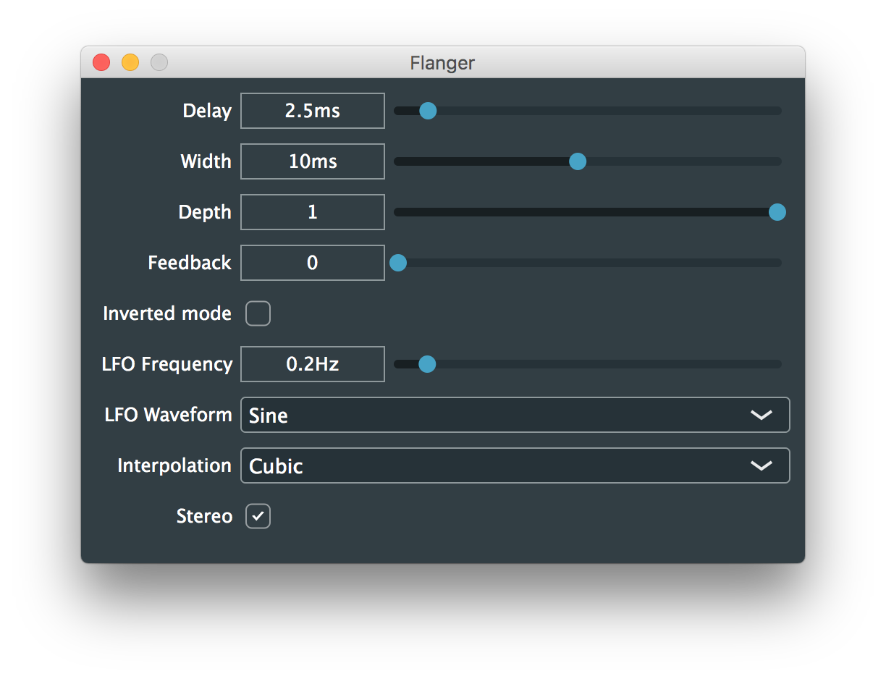

- [**Chorus**](Chorus) simulates the phenomenon that occurs when various musicians perform the same piece at the same time, i.e. it creates copies of the input signal with small variations in pitch and time, making a single source sound as if it was many individual recordings.
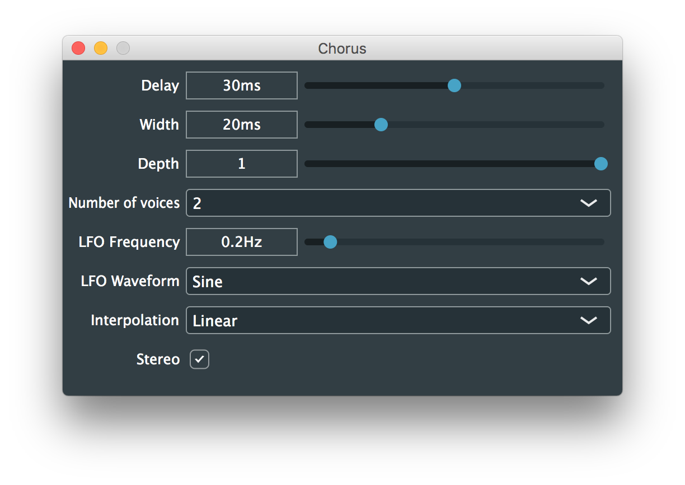

- [**Ping-Pong Delay**](Ping-Pong%20Delay) is a stereo version of the basic delay. In the Ping-Pong Delay, the delayed signal bounces between the left and the right channels.


- [**Parametric EQ**](Parametric%20EQ) implements various types of parametric filters (low-pass, high-pass, low-shelf, high-shelf, band-pass, band-stop, and peaking/notch). First and second order filters can be selected and adjusted according to the cut-off frequency, quality factor (bandwidth), and gain.


- [**Wah-Wah**](Wah-Wah) is an audio effect that injects a speech-like character to the input sound. It can be used in manual mode, where the cut-off frequency of a resonant low-pass, a band-pass, or a peaking/notch filter is changed with a slider, or in automatic mode where the cut-off frequency of the filter is controlled with an LFO, with the envelope of the input signal, or with a combination of both.
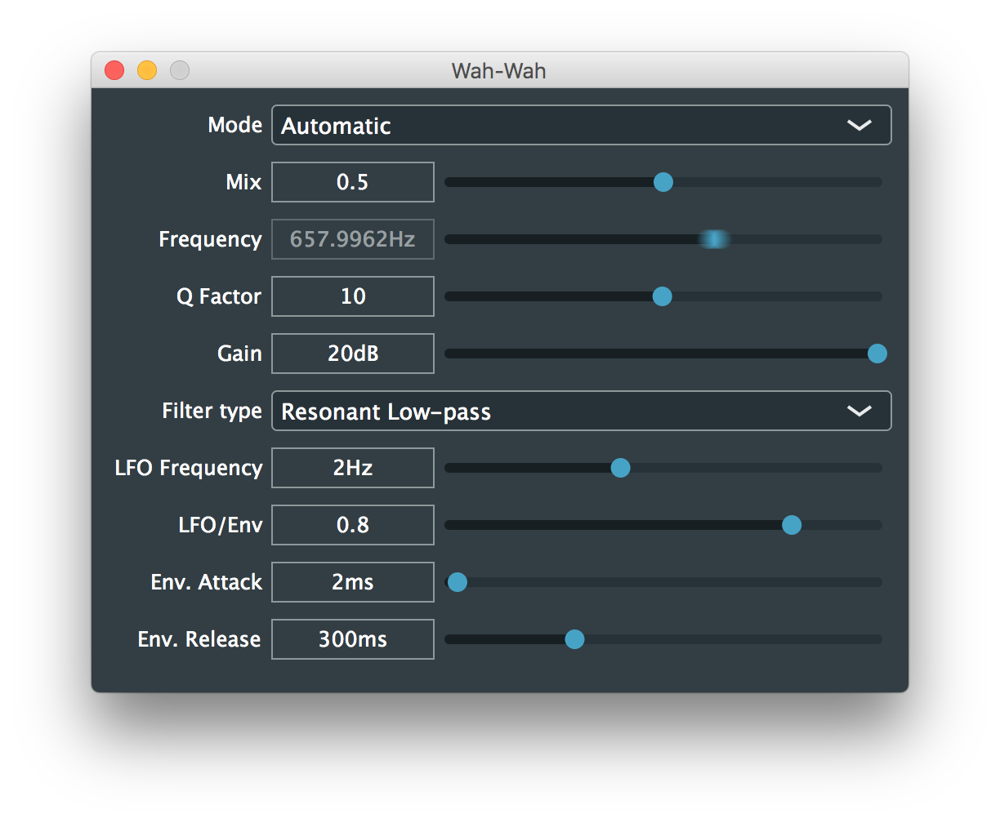

- [**Phaser**](Phaser) uses all-pass filters in cascade configuration to introduce phase shifts to the input signal. These shifts create notches in the frequency spectrum when the filtered signal is mixed with the original one. The phaser produces a similar effect to the flanger, but there is potentially more control on the location of the notches.
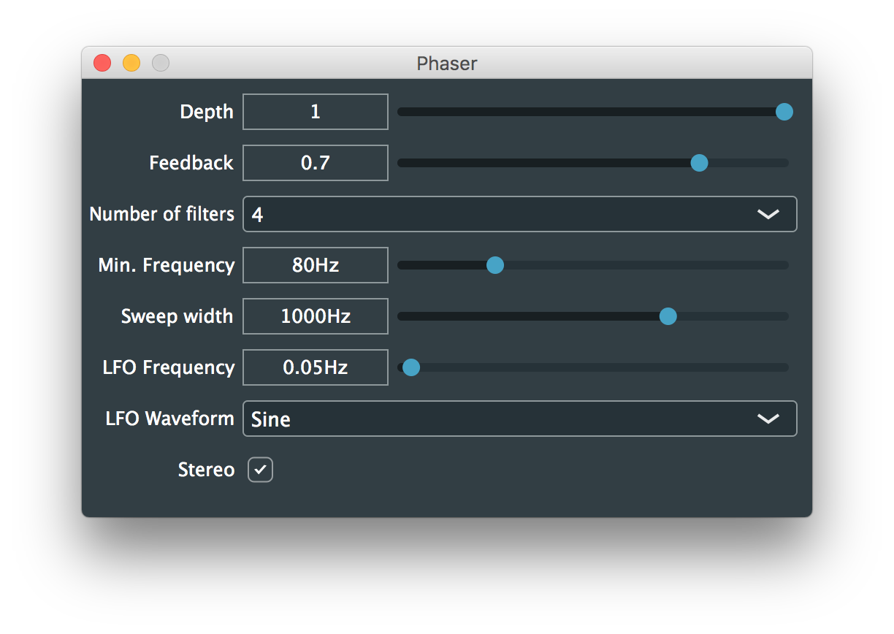

- [**Tremolo**](Tremolo) uses an LFO to modulate the amplitude of the input signal. This simulates small variations in the level of the signal or turns a single sustained note into a series of fast repetitions.
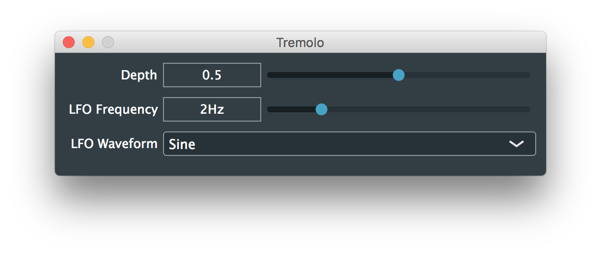

- [**Ring Modulation**](Ring%20Modulation) is the result of multiplying the input signal with a periodic carrier (similar to the tremolo but at higher frequencies). It is a non-linear audio effect that creates a very inharmonic sound.


- [**Compressor/Expander**](Compressor-Expander) implements four audio processors in one (compressor, limiter, expander, and noise gate). The Compressor/Limiter configuration reduces the dynamic range of the signal by attenuating sections of the input sound with higher gain than the threshold. The Expander/Noise gate configuration increases the dynamic range by attenuating sections of the input sound with lower gain than the threshold.
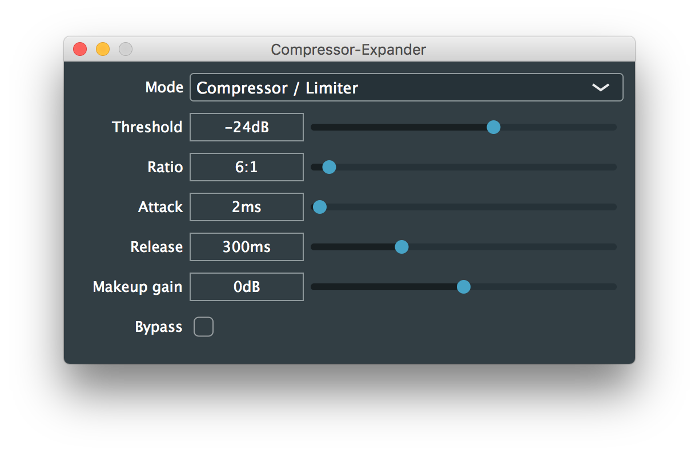

- [**Distortion**](Distortion) applies a non-linear transformation to the input sound which increases its gain to limits that create a harsh, fuzzy, or gritty sound. Different non-linear functions can be selected and the output gain can be controlled individually to restore the original loudness level. A high-shelf filter can be used to control the tone of the output sound as well.
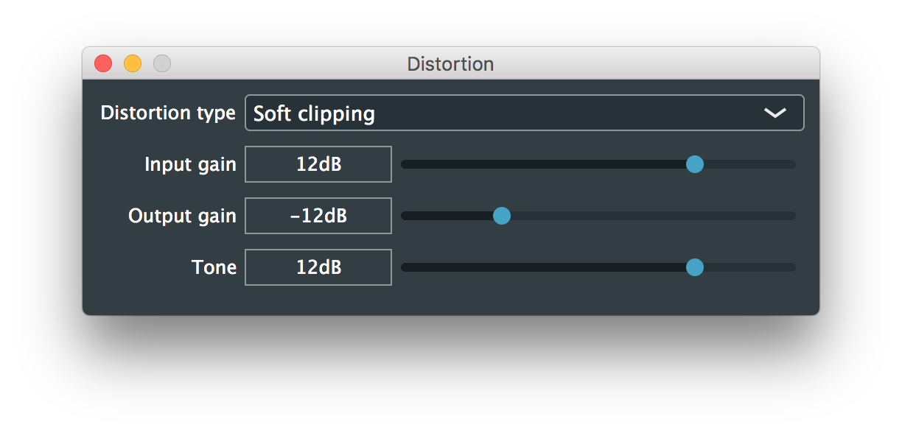

- [**Robotization/Whisperization**](Robotization-Whisperization) implements two audio effects based on the phase vocoder algorithm. This plugin is meant to be used with speech sounds. Robotization applies a constant pitch to the signal while preserving the formants, the result sounds like a robotic voice. Whisperization eliminates any sense of pitch while preserving the formants, the result should sound like someone whispering.
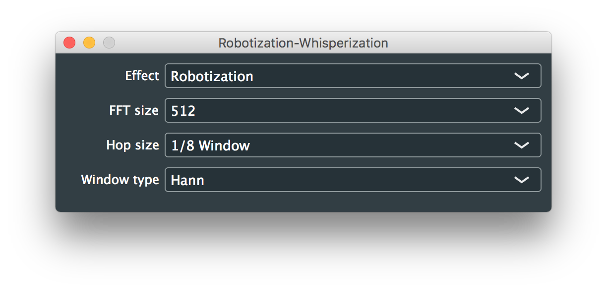

- [**Pitch Shift**](Pitch%20Shift) changes the pitch of the input signal without changing the duration using the phase vocoder algorithm. It is a real-time implementation that allows continuous and smooth changes of the pitch shift parameter.


- [**Panning**](Panning) changes the apparent position of a sound source between two channels, left and right. It can be used in two modes, the first mode uses the precedence effect and the tangent law to adjust the time delays and gains of the left and right signals, it is good for reproduction over loudspeakers assuming a standard stereo layout. The second mode uses a spherical model of the head to estimate Interaural Time Difference (ITD) and Interaural Level Difference (ILD), it is good for reproduction over headphones.
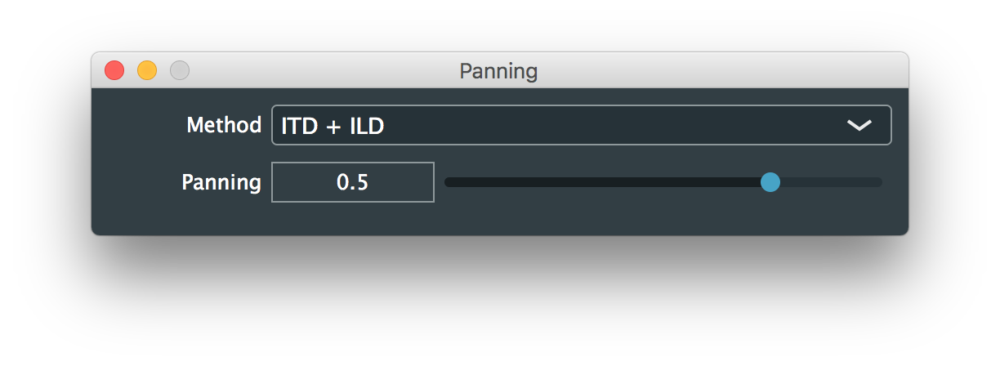

# Clone and build
These plugins are implemented using [JUCE](https://juce.com/), which provides a framework for building audio plugins for various platforms (Windows and macOS), and in multiple formats (VST, AU, RTAS, AAX, etc.), as well as standalone applications. You can run the following commands in the terminal to clone this repository and to checkout the latest version of JUCE that was used to build all the projects:
```
git clone https://github.com/juandagilc/Audio-Effects.git
cd Audio-Effects/
git submodule update --init
```

# License
Code by Juan Gil <https://juangil.com/>.
Copyright &copy; 2017-2019 Juan Gil.

This program is free software: you can redistribute it and/or modify
it under the terms of the GNU General Public License as published by
the Free Software Foundation, either version 3 of the License, or
(at your option) any later version.

This program is distributed in the hope that it will be useful,
but WITHOUT ANY WARRANTY; without even the implied warranty of
MERCHANTABILITY or FITNESS FOR A PARTICULAR PURPOSE.  See the
GNU General Public License for more details.

You should have received a copy of the GNU General Public License
along with this program.  If not, see <https://www.gnu.org/licenses/>.
